# VoxFit — Voice-First Fitness Logging for the Modern Gym

      [](https://voxfit.amitpile.com/auth/welcome)

**Speak your workout. Track your progress. Let an AI coach watch your trends.**

VoxFit is a voice-first fitness logging application designed for gym-goers and fitness communities who want to log their workouts and meals without typing. Just speak naturally — "did three sets of ten twenty thirty on bench" — and VoxFit's AI parses it into structured workout data in seconds. On top of that, an agentic AI coach generates personalized workout plans on demand, writes a weekly progress reflection automatically, and nudges you when your training has drifted from your plan.

Everything you log then reads back: which muscle groups you actually hit this week, where your volume is going, badges that stay earned, a rolling four-week volume trend, and a streak you can share as a rendered poster.

🔗 **Live app:** [voxfit.amitpile.com](https://voxfit.amitpile.com/auth/welcome)

📄 **Product docs** (Notion)
- [VoxFit — PRD & Design](https://app.notion.com/p/VoxFit-PRD-and-Design-3a72d7e24b0581088740dd1e36936c8b) — the living product record
- [PRD: AI Workout Planner & Progress/Wellness Coach](https://app.notion.com/p/3a72d7e24b05816b9771f25975686f32) — the agent, the weekly cron, the safety framing
- [PRD: Dusk Design System & UI Revamp](https://app.notion.com/p/3b72d7e24b05819daa53fac31717d7e2) — tokens, component library, screen migration
- [PRD: Progress Intelligence](https://app.notion.com/p/3b72d7e24b0581c48272d353586800a8) — muscle split, badge ledger, streak poster, volume trend

## Project Glimpses

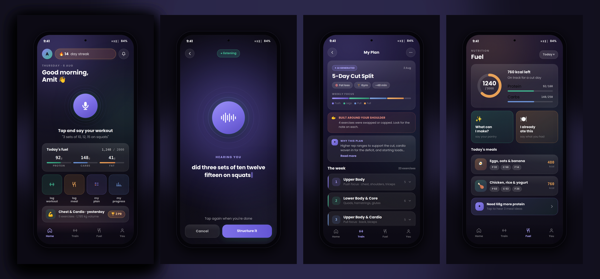

The **Dusk** design system across ten screens: gradient canvas, glass surfaces, the voice orb as the hero, and one accent per job.

| | | |
|---|---|---|
| 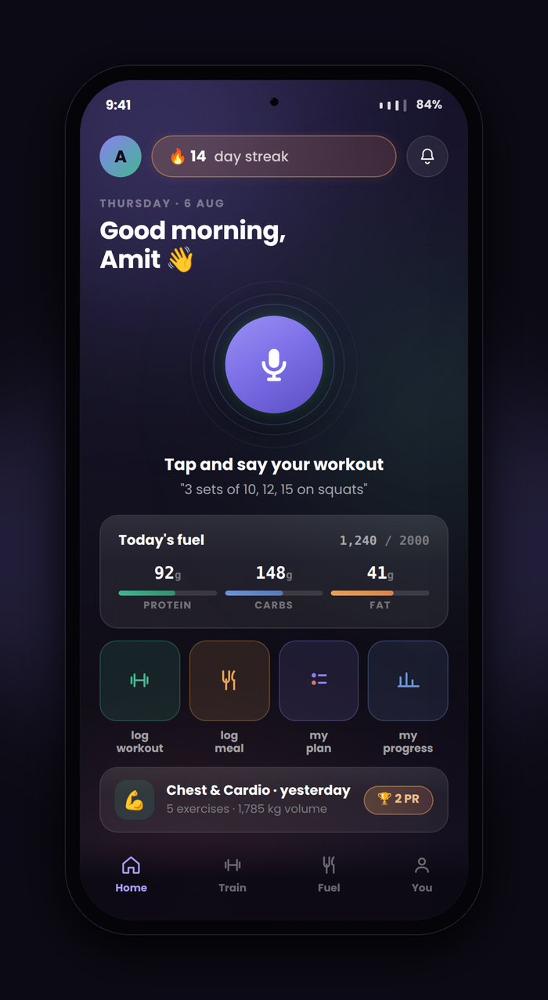<br>**Home** — voice orb, streak pill, today's fuel, quick actions | 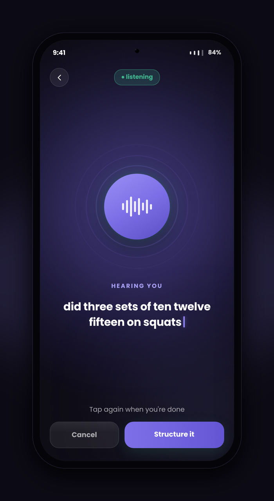<br>**Voice capture** — tap to record, waveform while listening | 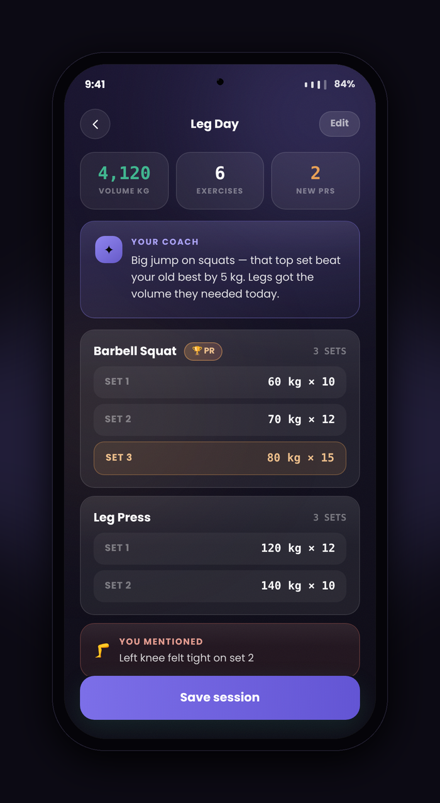<br>**Session result** — hero stats, coach note, per-set breakdown, PR highlight |
| 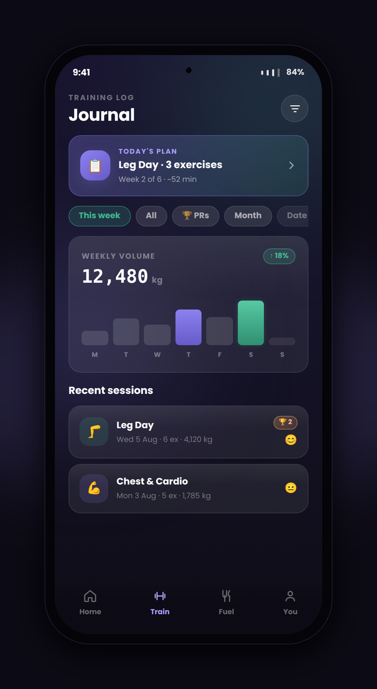<br>**Train** — plan banner, filters, weekly volume, recent sessions | 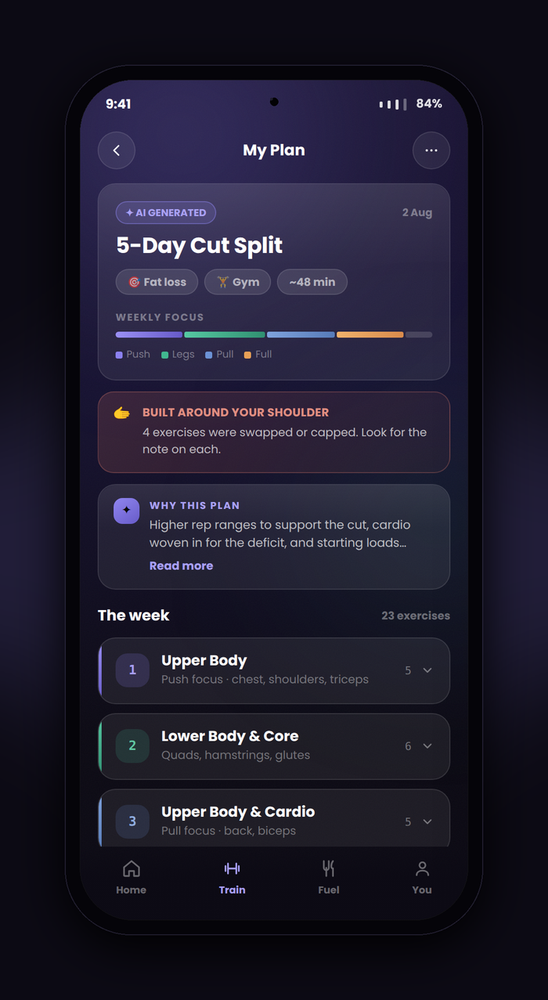<br>**My Plan** — AI-generated split with per-session rationale | 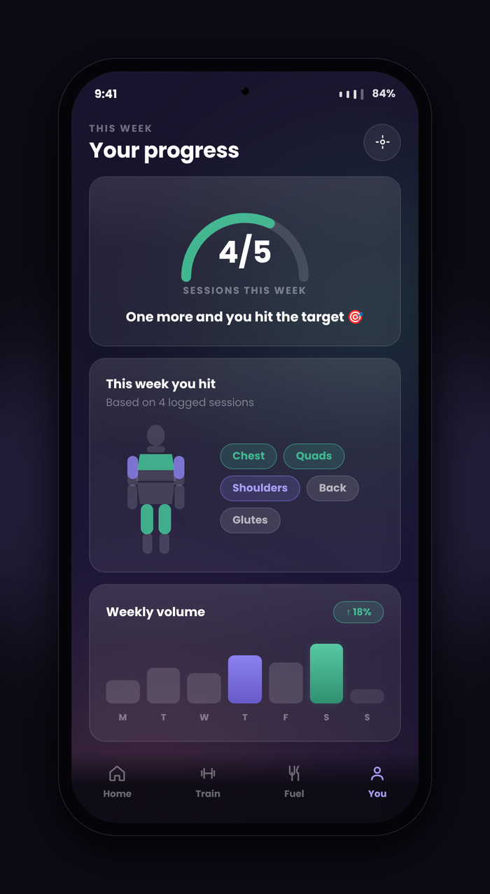<br>**My Progress** — sessions ring, muscle map, volume trend |
| 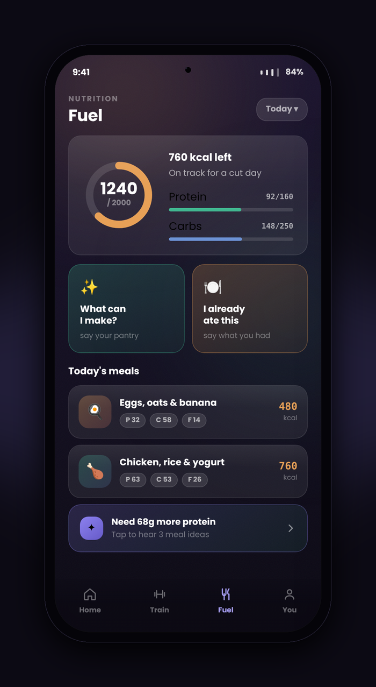<br>**Fuel** — calorie ring, two voice modes, per-meal glyphs | 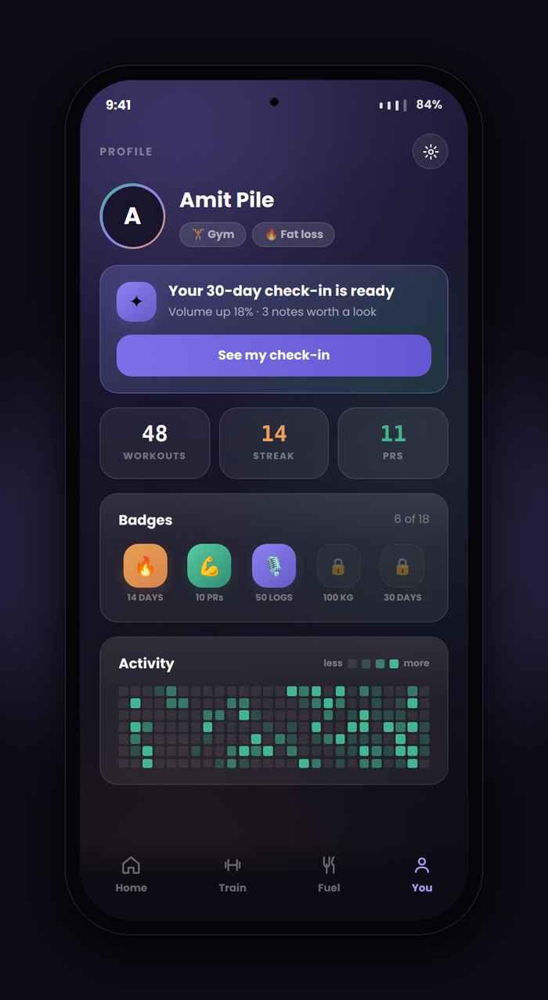<br>**Profile** — check-in nudge, all-time stats, badge shelf, heatmap | 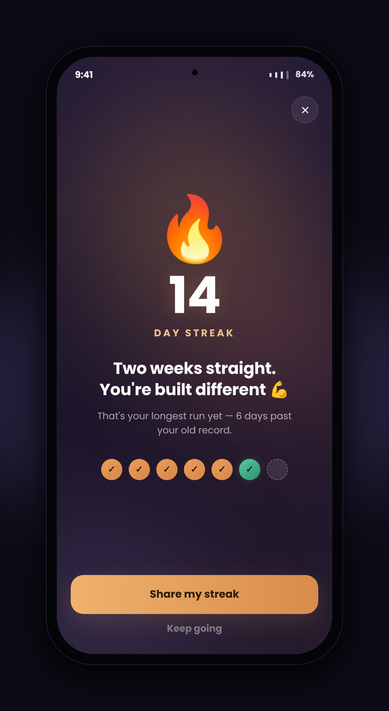<br>**Streak moment** — the screen behind the shareable poster |
| 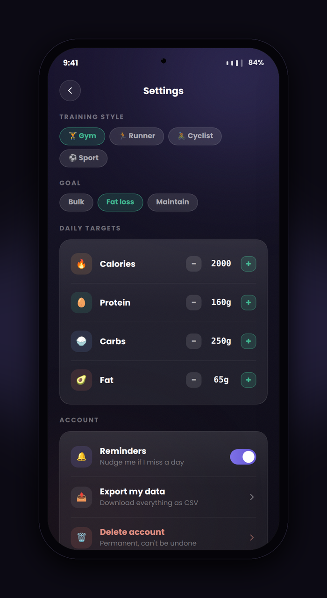<br>**Settings** — training style, goal, macro steppers, account | | |

Also in [`mockups/`](mockups): `00_gallery_grid.png` (all ten as one sheet) and `00_hero_banner.png` (staggered three-phone hero, for a landing page or social post).

<details>
<summary><b>These are device-framed design mockups, not live captures — and three things in them aren't built</b></summary>

The mockups are the design source of truth for the Dusk system and match the shipped UI closely, but they are renders rather than screenshots of the running app. Three details in them are deliberately **not** in the build, each for a reason recorded in [Future Features](#future-features):

- **The notification bell** on Home — there is no notification centre. That slot is the profile avatar in the app.
- **The live transcript** on the voice capture screen — not producible any more, and not wanted. Voice capture records a clip and transcribes it in one server-side call (see [Voice capture](#data-flow--voice-logging)), so there is no word-by-word stream to render. The screen shows a **live microphone level** instead, which is the honest version of the same reassurance: it moves only when the mic is actually hearing you.
- **Reminders and "Export my data as CSV"** in Settings — neither has infrastructure behind it yet, and a dead toggle is worse than an absent one.

Real on-device screenshots are still on the list to capture.
</details>

## Features

🎙️ **Voice-First Workout Logging**
- Tap-to-talk mic interface for capturing workout sessions
- **Record → transcribe → parse.** The app records a bounded audio clip on the device and sends it to a Supabase Edge Function, which transcribes it with **Groq `whisper-large-v3-turbo`**; the transcript then goes to Gemini 2.5 Flash for structuring. This replaced live browser/OS speech recognition entirely — see [Why recording replaced live speech recognition](#why-recording-replaced-live-speech-recognition)
- Whisper is given a **gym-vocabulary biasing prompt** (lifts, units, RPE, common Indian foods) and greedy decoding, so "lat pulldown" stops coming back as "lap pull down" and silence stops being filled with hallucinated repeats
- AI-powered parsing (Gemini 2.5 Flash) converts natural speech into sets, reps, weights, cardio segments — even messy or repeated phrasing
- A **live microphone level** drives the orb's waveform while recording, so the animation can't say "listening" when the mic is dead
- Review & edit AI-extracted data before saving — your data, your control

🍽️ **Voice-Driven Meal Logging**
- Tap-to-speak meal suggestions based on your cravings and pantry, complete with recipes
- Tap-to-speak logging of meals you've already eaten — describe it once, AI estimates the nutrients and logs it
- Track calories and macros (Protein, Carbs, Fats) against daily targets
- The model picks **one dish-specific emoji** per meal, persisted on the row — so a long history is scannable by icon instead of four repeating meal-type glyphs. Validated like any other model output: prose, refusals and multi-glyph runs are rejected and fall back to the meal-type icon
- Tapping a logged meal opens a centred **recipe dialog** — tinted hero, macros, the AI's reason for suggesting it, numbered method steps

🤖 **AI Workout Plan Generator** *(on-demand)*
- A real Gemini **tool-calling agent** — not a single prompt — reads your training history, recurring physical notes, and goals through read-only tools (`get_training_stats`, `get_recurring_notes`, …) before writing anything
- Generates a multi-day structured plan (`workout_plans` table) with a written rationale per session, grounded only in data the tools actually returned — no invented numbers
- Review the generated plan, then **Save** (marks it active, supersedes the previous plan) or discard
- Runs server-side in a Supabase Edge Function; the model never writes to the database directly — a deterministic orchestrator does, after parsing and validating the model's output

🧭 **AI Progress Coach** *(weekly reflection, on-demand + automatic)*
- The same agent engine, aimed at a different question: "how has this athlete actually been doing?"
- Reads training stats, nutrition adherence, and recurring physical notes over the trailing window, then writes a calm, plain-language reflection — highlights, trends, gentle recurring-note callouts, and suggestions for the week ahead
- **Safety-first prompt design**: purely observational, never diagnostic — no medical language, no "health flags," no assessment tone. A single non-alarmist "consider talking to a professional" line appears only for genuinely recurring notes, never repeated or dramatized
- Trigger it yourself from Profile ("Check my progress"), or let it run automatically every week — see **Weekly Automation** below

🔔 **Plan-vs-Actual Nudge** *(automatic, tied to your active plan)*
- If you have an active plan, the weekly coach run also compares planned sessions against what you actually logged and computes an adherence score and drift signal (on track / mild / severe)
- Plan age is accounted for, so a plan you started three days ago is never flagged as "severely behind" just because the full lookback window hasn't elapsed yet
- On severe drift, a calm nudge card on the Train tab offers to **refresh your plan** — one tap regenerates a plan that matches how you're actually training, instead of nagging you to catch up to a stale one

⏰ **Weekly Automation** *(`pg_cron` + `pg_net`, fully server-side)*
- Every Sunday at 06:00 UTC, a Postgres-scheduled job selects every user with logged activity in the last 30 days and dispatches one async, authenticated request per user to the coach's edge function — no idle users, no wasted AI calls
- Idempotent by design: each user gets **at most one** review and nudge per calendar week, safe to re-run or overlap without ever duplicating
- The exact same edge function serves both the manual "Check my progress" button and the weekly cron — one engine, two triggers, so what you test on-demand is exactly what runs unattended
- Passive **pointer cards** on Home ("New check-in ready," "New plan nudge") let you know something's waiting on Profile/Train without ever surfacing content on Home itself

📊 **Workout Analytics & History** *(`/progress`)*
- Every chart on its own **My Progress** screen, so Profile isn't identity, badges and preferences competing with six charts for the same scroll
- All-time stat tiles, sessions-this-week ring against your own target, weekly volume, strength trend per exercise, macro rings, 26-week activity heatmap, and six months of workout + calorie history
- **Strength trend, per exercise you choose.** A bottom-sheet picker lists every strength lift you've ever logged (most-logged first, cardio excluded because it has no top-set weight to plot); the page still opens on your main lift so nothing has to be chosen before you've seen the chart
- Points are spaced **proportionally to elapsed time**, not by ordinal — a two-day gap and a month-long plateau must not draw the same slope. Dates are real axis labels, thinned rather than rotated or shrunk, and any point can be tapped for its exact weight and date
- Both queries are server-side RPCs (`get_exercise_trend`, `get_logged_exercises`, migration `0015`) instead of pulling sessions plus `set_lines` to the client and aggregating there — which also removed a second, client-side copy of "what is the heaviest set"
- Mood/energy tracking per session, PR detection, and a filterable training journal (mood, has-PRs, has-notes)

💪 **Muscle Split — what you actually trained**
- Every logged exercise resolves to a muscle group, so *"what did I hit this week"* and *"where is my volume going"* are real answers
- **Two-tier resolution, cheapest first:** a global seeded lookup (91 common lifts) handles most logs instantly, deterministically and free
- Anything it misses is classified once by Gemini **asynchronously** — a statement-level trigger fires one `pg_net` request per session while the insert commits immediately, so classification never blocks a log
- Because the lookup is **global rather than per-user**, a novel exercise name costs exactly one AI call for the whole product, ever
- Both components name what they can't show — how many exercises are still classifying, and which groups were trained but carry no tonnage to chart

🏆 **Automatic PR Detection**
- Every logged strength exercise is compared against your own history — heaviest top-set weight ever, by canonical exercise name (normalized + curated aliases, so "Pec Fly" and "Chest Flies" share one history while equipment variants like barbell vs. dumbbell bench stay separate)
- Runs entirely in Postgres via insert/delete triggers on `exercises_logged` — no AI call, no async gap, the flag is already correct by the time the review screen reads the row back
- Declared and detected PRs are tracked separately (`pr_source`): a claim you spoke or ticked yourself is never overwritten by detection, and editing a session afterward never launders a detected PR into a permanent declared one

🏅 **Badges & Weekly Target**
- Thresholds live in the database as the awarding authority; the earned ledger is **select-only under RLS**, so a badge can't be self-granted from a client
- Awarding happens on read inside one `SECURITY DEFINER` RPC — idempotent, one place for the threshold logic, and impossible for a write path to forget. Badges no longer un-earn themselves when a streak lapses
- One RPC returns stats, the full shelf and persists new awards, replacing two count queries plus client-side evaluation
- Your **weekly session target** is set in onboarding and editable in Settings, instead of being inferred from whatever plan happened to be active

🔥 **The Streak Moment** *(`/streak`)*
- Tap the streak pill on Home for a full celebration screen: day count at poster scale, the week's dots, best run, days logged
- **"Share my streak" renders a 1080×1350 PNG poster** on a canvas and hands it to the OS share sheet as a file — no dependency, no external fetch, identical in the Android WebView
- Composed as a poster, not a screenshot: one enormous numeral, the week's dots as the receipt that proves it, a quiet wordmark strip. Falls back to saving the image where a WebView won't accept file payloads

📈 **"You're trending up"**
- A rolling four-week volume comparison against the four before, and against every four-week stretch on record
- Weeks off count as **zero**, not as gaps — otherwise a naive read reports growth across a two-month layoff
- Stays silent without a real baseline to divide by, without two full windows of history, or on a move under 5% (that's one extra set of squats)
- **No "down" state** — a banner telling you your training is shrinking is a nag, not a nudge. The volume chart directly below it speaks for itself

⚙️ **Mobile-First, Cross-Platform**
- Responsive mobile-web app (desktop fallback supported)
- One-codebase deployment to browsers and Play Store (via Capacitor)
- Audio capture via `@capgo/capacitor-audio-recorder` — the same API on web (MediaRecorder, Opus in WebM) and Android (AAC in MPEG-4), so voice logging no longer depends on the browser's or the OS's speech recogniser being available or reliable
- Skeleton loading on every data-driven screen, sized to the shape that's coming, so nothing pops in or shifts under a thumb
- Offline-first logging is **not** built yet — see [Future Features](#future-features)

🎨 **Dusk Design System**
- Plum-ink gradient canvas, translucent glass surfaces, hairline borders and a top rim-light — depth from stacked layers, never from shadows
- Five accents with exactly one job each (see [Design System](#design-system)), so colour carries meaning instead of decoration
- Self-hosted fonts (Poppins for display and body, JetBrains Mono for every numeric display)
- 44px minimum tap targets grown with padding rather than size; every animation silenced under `prefers-reduced-motion`
- The AI coach surfaces keep the same calm, non-alarmist register even for "attention"-tone content (no red/danger styling, ever) — enforced by a unit test, not just convention

## Tech Stack

| Layer | Technology |
|-------|-----------|
| **Frontend** | Angular 20 (standalone components, signals), Ionic Angular 8, Tailwind CSS v4 |
| **Mobile/Desktop** | Capacitor 8 (native bridge to Android & web), mobile-web |
| **Backend** | Supabase (PostgreSQL, Auth, Edge Functions, `pg_cron`, `pg_net`, Vault) |
| **Speech-to-text** | Groq `whisper-large-v3-turbo`, called server-side from the `transcribe-audio` Edge Function. Audio is captured with `@capgo/capacitor-audio-recorder` (web + Android) |
| **AI** | Google Gemini 2.5 Flash — single-shot extraction (workout parsing, meal suggestions, eaten-meal analysis, muscle-group classification) and a **tool-calling agent loop** (workout plan generation, weekly progress coach) |
| **Automation** | `pg_cron` (weekly schedule) + `pg_net` (async HTTP dispatch, also used for muscle classification) + Supabase Vault (secret storage) — server-side only, no third-party job queue |
| **Fonts** | Poppins 500/600/700, JetBrains Mono 400/500/700 (self-hosted via @fontsource — no CDN, so the WebView renders offline) |
| **Icons** | Ionicons 7 |
| **State** | Angular signals (lightweight, reactive) |

## Getting Started

### Prerequisites

- **Node.js** 18+ (npm 9+)
- **Supabase** account (free tier available)
- **Google Gemini API** key
- **Groq API** key — for speech-to-text. Server-side only: it is set as a Supabase secret (`GROQ_API_KEY`), never as a build variable, because there is no client-direct transcription path by design
- **Android SDK** (optional, for native development)

### Installation

```bash
# Clone the repo
git clone https://github.com/amit429/VoxFit.git
cd VoxFit

# Install dependencies
npm install

# Set up environment
cp src/environments/environment.demo.ts src/environments/environment.dev.ts
# Edit environment.dev.ts with your Supabase URL and anon key
```

### Environment Setup

Edit `src/environments/environment.dev.ts`:

```typescript
export const environment = {
  supabaseUrl: 'https://YOUR_PROJECT.supabase.co',
  supabaseAnonKey: 'YOUR_ANON_KEY',
  // Local dev only, and only needed if you set useGeminiEdgeFunction: false to
  // iterate without deployed Edge Functions. Leave it '' otherwise. This file is
  // git-ignored, but anything in it is compiled into the bundle — never copy this
  // key into environment.prod.ts or a build env var. See Deployment below.
  geminiApiKey: '',
  useGeminiEdgeFunction: true, // use Supabase Edge Function instead of client-side Gemini
};
```

### Development Server

```bash
# Start dev server (mobile viewport recommended)
npm start

# Build for production
npm run build:prod

# Test on Android (with Capacitor)
npm run android:run:dev
```

## Architecture

### Pages & Routes

Four tabs plus three standalone routes. Routing is gated by four composed guards, each encoding one state of the sign-in/onboarding machine rather than a generic "is logged in" check.

- **Auth**: Welcome, Login, Register, Onboarding (profile setup, incl. weekly session target)
- **Home** (`/tabs/home`): Voice orb as the hero, streak pill, daily macros, quick actions, last session, passive AI coach pointer cards
- **Voice Log** (`/voice`): Tap-to-talk workout capture with AI review
- **Train** (`/tabs/workout`): Session journal, plan banner, weekly volume chart, filter sheet (mood / has-PRs / has-notes), plan-vs-actual nudge card
- **Workout Plan** (`/tabs/workout/plan`): Generate/review/save an AI-generated multi-day plan with per-session rationale
- **Session detail** (`/tabs/workout/:sessionId`): Hero stat tiles, coach note, per-set breakdown, "you mentioned" notes card
- **Diet Voice Log** (`/log-diet`): Tap-to-speak — suggest a meal from pantry/cravings, or log a meal you already ate. Accepts `?mode=suggest|log_eaten` for deep-linking
- **Fuel** (`/tabs/diet`): Meal log, calorie ring, macro tracking, day/week views, recipe dialog
- **You** (`/tabs/profile`): Identity, badge shelf, compact check-in nudge (opens the full review in a centred dialog), link to My Progress
- **My Progress** (`/progress`): Every chart — stat tiles, sessions ring, muscle map, muscle split, volume, strength trend, macro rings, heatmap, monthly history, volume-trend nudge
- **Streak** (`/streak`): The streak moment + shareable poster
- **Settings** (`/settings`): Edit profile & preferences (macro targets, sport, goal, weekly target), about, sign out, delete account

### Data Flow — Voice Logging

```
User taps the orb
    ↓
Record a bounded clip on-device (@capgo/capacitor-audio-recorder)
web → Opus in WebM · Android → AAC in MPEG-4 · 3-minute hard cap
live input level drives the orb's waveform while recording
    ↓
Tap to stop → upload the clip (multipart) to `transcribe-audio` (Edge Function)
    ↓
Groq whisper-large-v3-turbo + gym-vocabulary prompt, temperature 0
    ↓
Transcript → Gemini AI (extract-workout / suggest-diet-meals / log-food)
    ↓
Structured Data (exercises, sets, reps, weight)
    ↓
User Review/Edit (vox-card, modals)
    ↓
Save to Supabase (PostgreSQL)
    ↓
Analytics & History (charts, heatmap, stats)
```

The processing screen names which half of the wait you're in ("Sending your recording" → "Transcribing" → "Parsing your session") rather than showing one opaque spinner across two very different operations.

### Why recording replaced live speech recognition

The app previously used the Web Speech API in the browser and
`@capacitor-community/speech-recognition` on Android. Both are **session** based:
the recogniser ends itself after a second or two of silence and has to be
restarted, and every restart can fail — Android's `SpeechRecognizer` routinely
answers `ERROR_RECOGNIZER_BUSY` when restarted from inside its own stop callback.
A failed restart left the app capturing nothing while the orb still said
"listening", and the audio spoken during each restart gap was dropped outright.
Roughly 300 lines of restart bookkeeping, boundary de-duplication and
cross-session transcript stitching existed to paper over that, and it still
lost words — and the stitching was where the duplicated-sentence transcripts
seen on web/Chrome came from.

A recording has no session to time out, so that entire class of bug does not
exist on this path. What the change bought and cost:

| | Live recognition (old) | Record + transcribe (new) |
|---|---|---|
| Failure mode | Silent — UI says "listening", nothing is captured | Loud — the upload or the call fails, and the user is told |
| Accuracy | Whatever the device/browser ships, unversioned | One pinned model, same on every platform, plus a domain vocabulary prompt |
| Domain terms | No lever at all | Whisper's 224-token biasing prompt (lifts, units, RPE, foods) |
| Mic feedback | Orb animated identically whether the mic worked or not | Real input level, sampled at 10 Hz |
| Live transcript | Produced, but never rendered in any template | Not produced — costs nothing, since nothing consumed it |
| Cost | Free | ~$0.04 per audio-hour, plus one extra round trip |

`whisper-large-v3-turbo` over the full `whisper-large-v3` is a deliberate trade:
~12% WER at $0.04/audio-hour against 10.3% at $0.111. The gap is noise next to
what Gemini then does with the text — it already reconciles messy phrasing — so
the cheaper, faster model is the right one for a voice logger.

Guardrails on this path: a 3-minute recording cap (a phone left recording in a
pocket costs one wasted request, not a failed one, and the audio captured before
the cap is still submitted rather than discarded), a 12 MB request ceiling,
15-second timeouts around the native bridge, and the same per-user AI quota the
Gemini functions enforce. Note that one voice log now spends **two** daily quota
events: `transcribe-audio`, then the Gemini function.

Unlike the Gemini services there is deliberately **no client-direct twin and no
`environment.useGeminiEdgeFunction` gate** for transcription: a Groq key cannot
ship in the bundle (`scripts/scan-bundle-secrets.js` would flag it, correctly),
so the Edge Function is the only path.

### Data Flow — AI Coach (agent + weekly automation)

```
                     ┌─────────────────────────┐
Tap "Check my        │                         │   pg_cron (Sun 06:00 UTC)
progress" / "Generate│                         │   selects active users (≥1 session
my plan" ────────────┤   Edge Function         │   or meal logged in last 30 days)
                     │   (Gemini tool-calling  │◄──┐
                     │    agent loop)          │   │ pg_net async HTTP POST
                     └───────────┬─────────────┘   │  (one call per user,
                                 │                  │   service-role authenticated)
                    read-only tools query           │
                    Postgres (training stats,       │
                    nutrition, recurring notes, ┌───┴────────────────┐
                    active plan, plan-vs-actual)│ pg_cron dispatcher │
                                 │               │ (security definer, │
                                 ▼               │  reads secrets from│
                   Deterministic orchestrator    │  Vault)            │
                   validates + writes JSON       └────────────────────┘
                   (model never writes to DB)
                                 │
                                 ▼
          workout_plans / progress_reviews / plan_nudges
          (idempotent: one row per user per week/plan)
                                 │
                                 ▼
        Plan review card · Progress review card · Plan-nudge card
        (Workout / Profile / Home pointer cards)
```

The **on-demand button** and the **weekly cron** hit the exact same edge function — the only difference is who's asking (a signed-in user's JWT vs. a server-side service-role call with a target `user_id`). That's a deliberate design choice: what you test manually is exactly what runs unattended.

### Data Flow — Async Muscle Classification

The pattern for anything expensive that happens *because of* a write but must never slow it down:

```
Log a workout
    ↓
BEFORE INSERT trigger → resolve each name from exercise_muscle_map (global lookup)
    ↓
all resolved? ──yes──→ INSERT commits. Done. Zero AI cost.
    │
    no
    ↓
AFTER INSERT ... FOR EACH STATEMENT (transition table)
collects the unresolved names — one request per session, not per exercise
    ↓
pg_net.http_post → classify-exercise-muscles      ┐ insert commits
(secrets from Vault, same pattern as the cron)    ┘ immediately — user never waits
    ↓
Edge fn: re-check the cache first (two sessions logged back to back
would otherwise both pay for the same name)
    ↓
Gemini classifies only the novel names
    ↓
Validate every group against the enum ('other' fallback),
refuse any name it wasn't asked about
    ↓
UPSERT exercise_muscle_map → backfill every unclassified row
with those names, across all users
```

Muscle groups are denormalized onto `exercises_logged.primary_muscle` at insert time, which is what makes the Progress reads indexed aggregates rather than a classify-on-read. There is deliberately **no per-user rollup table** — a rollup would need full recomputation whenever a session is edited or deleted (the same cost as just querying) while adding a way for numbers to go stale. The genuinely expensive part is the AI classification, and that *is* cached permanently.

## Design System

VoxFit uses the **Dusk** design system, defined as CSS custom properties in `src/theme/variables.scss`. Depth comes from three stacked layers — a single gradient canvas, blurred accent blobs placed per screen, and a fine grain overlay above content — rather than from elevation.

| Token | Value | Use |
|-------|-------|-----|
| Canvas gradient | `#1c1536` → `#151228` → `#0d0b18` → `#191029` | One continuous plum-ink ramp across the whole app shell |
| Surface 1–4 | translucent glass + hairline border + top rim-light | Cards, sheets, tab bar — the rim-light is what separates a surface from the canvas |
| Periwinkle (brand) | `#887bfc` | CTAs, focus rings, brand — **and anything AI-authored** |
| Jade | `#33c998` | Affirmative — logged, on track, current best |
| Apricot | `#f8a44c` | Streaks and personal records |
| Rose | `#e77161` | User-reported notes — **deliberately not an alert red** (product-safety requirement, not taste) |
| Slate | `#6693e3` | Secondary data series |

Each accent has exactly one job, so colour carries meaning instead of decoration. `--vox-on-jade` / `--vox-on-apricot` exist because white text fails contrast badly on both fills; every place those fills appear uses the assigned ink.

**Typography** (Poppins + JetBrains Mono)
- Display: **600 weight, not 700** — the lighter weight is what keeps this out of mass-market fitness register
- Body: Poppins 500
- Mono: every numeric display (reps, weights, macros) for tabular alignment

**Spacing**: 4px base unit, plus `--vox-space-stack` (20px) and `--vox-space-card` (18px). Pages set their rhythm once via `.vx-stack` on `<main>` rather than sprinkling margins on children, so it stays even when sections are reordered.
**Radii**: xs(4px) → sm(6px) → md(8px) → lg(12px) → xl(18px) → 2xl → pill(9999px)

**Rules**
- One accent per job — never a card fill, never a gradient outside the brand CTA and the orb
- No pill-shaped CTAs (md radius only); pill radius is reserved for badges and chips
- No box-shadows — hierarchy via the surface ladder + hairlines
- **One glow in the entire system**: the voice orb
- 44px minimum tap targets, grown with `content-box` padding + negative margin rather than by enlarging the visual
- Every animation silenced under `prefers-reduced-motion`
- Emoji chrome → ionicons via the `vox-icon` wrapper; emoji that *is* AI-generated data (a meal's glyph) stays

**Page shell convention**
- `vox-page-header` / `vox-card` are reserved for the auth flow (welcome, login, register, onboarding)
- Every other screen (tabs + standalone routes like `/voice`, `/log-diet`, `/progress`, `/streak`, `/settings`) uses a plain `<header>` with `vox-standalone-page` / `tab-page-content` classes and Tailwind utilities directly

> ⚠️ **Tailwind 4.2.4 caveat:** the installed version silently drops any class containing `.` `[` `]` or `/` — reproduced with a minimal PostCSS script, so it isn't an Angular config issue. Use the `.vx-*` escape hatches in `src/theme/vox-ui.scss` instead of arbitrary-value classes until the version is upgraded.

## Project Structure

```
voxfit/
├── src/
│   ├── app/
│   │   ├── pages/          # Route components (home, voice-log, diet, diet-voice-log, workout,
│   │   │                   #   workout-detail, workout-plan, progress, streak, auth, profile,
│   │   │                   #   settings)
│   │   ├── components/     # Shared UI: vox-card, vox-badge, vox-icon, vox-skeleton, vox-voice-orb,
│   │   │                   #   vox-streak-pill, vox-stat-tile, vox-quick-action-grid, vox-plan-banner,
│   │   │                   #   vox-progress-nudge, vox-macro-ring, vox-activity-ring, vox-volume-chart,
│   │   │                   #   vox-trend-chart, vox-heatmap, vox-badge-shelf, vox-muscle-map,
│   │   │                   #   vox-muscle-split, vox-segmented, vox-date-scrubber, vox-filter-sheet,
│   │   │                   #   vox-stepper-row, vox-meal-row, vox-checkin-modal, vox-recipe-modal,
│   │   │                   #   vox-exercise-picker
│   │   │                   #   + coach surfaces: plan-review-card, progress-review-card,
│   │   │                   #   plan-nudge-card, coach-pointer-card
│   │   ├── services/       # Auth, voice session (record + transcribe), Gemini (workout extract +
│   │   │                   #   diet + workout-plan + checkin),
│   │   │                   #   Supabase, journal, diet log, nutrition dashboard, workout-plan,
│   │   │                   #   progress-coach, badge, streak-milestone
│   │   ├── models/         # TypeScript types, one file per exported interface/type, all re-exported
│   │   │                   #   from models/index.ts — every consumer imports from `@/app/models`
│   │   ├── guards/         # Route guards (guest, auth, onboardingPage, onboardingComplete)
│   │   ├── utils/          # Formatters + pure logic: workout display, session filters, meal display,
│   │   │                   #   volume-trend (rolling windows), trend-chart-geometry (time-proportional
│   │   │                   #   plotting + label thinning), streak-share-image (canvas poster)
│   │   ├── prompts/        # Gemini system prompts (workout parser, meal suggester, eaten-meal
│   │   │                   #   logger, workout-plan builder, weekly coach builder)
│   │   └── data/           # Small fallback/mock display constants (not types)
│   ├── theme/              # Design tokens (variables.scss), vox-ui.scss utilities, fonts, buttons
│   ├── global.scss         # Tailwind @theme bridge, Ionic imports, fonts
│   └── index.html          # Viewport, meta tags, splash matching the canvas gradient
├── android/                # Capacitor Android project
├── supabase/
│   ├── functions/          # transcribe-audio (Groq Whisper speech-to-text)
│   │                       # extract-workout, suggest-diet-meals, log-food,
│   │                       #   classify-exercise-muscles  (single-shot Gemini calls)
│   │                       # generate-workout-plan, generate-checkin (Gemini tool-calling agent)
│   │                       # delete-account
│   │                       # _shared/guard.ts — origin allowlist, body caps, JWT check,
│   │                       #   per-user quota; guardBinaryRequest is the multipart variant
│   └── migrations/         # 0000 initial schema (base tables, RLS, grants, constraints —
│                           #      the ten pre-folder migrations, transcribed)
│                           # 0001 workout_plans · 0002 progress_reviews + plan_nudges
│                           # 0003 pg_cron/pg_net weekly dispatcher · 0004 service_role grants
│                           # 0005 email_exists check · 0006 weekly target + badge ledger
│                           # 0007 muscle groups + async classification · 0008 weekly volume series
│                           # 0009 diet_logs.emoji · 0010 automatic PR detection
│                           # 0011 profile body metrics · 0012–0013 walkthrough seen flags
│                           # 0014 AI rate limiting + hardening
│                           # 0015 exercise-trend RPCs (strength chart, server-side)
├── REVAMP-PROGRESS.md      # Phase-by-phase log of the Dusk revamp + the deferred-feature list
├── capacitor.config.ts     # Capacitor config (appId: com.voxfit.app)
└── angular.json            # Angular CLI workspace config
```

All type declarations live under `src/app/models/`, one file per exported interface/type (e.g. `user-profile.model.ts`, `workout-session-row.model.ts`), and re-exported through a single `models/index.ts` barrel — every consumer imports from `@/app/models` rather than reaching into individual files.

## Deployment

### Web
```bash
npm run build:prod
# Deploy www/ directory to Vercel, Netlify, or any static host
```

`environment.prod.ts` is git-ignored (see [Environment setup](#environment-setup) below), so hosts that
build from a fresh clone — like Cloudflare Pages — won't have it. `npm run build:prod` runs
`scripts/generate-prod-env.js` first, which generates it from env vars if the file isn't already
present. Set these in the host's project settings:

- `supabaseUrl`
- `supabaseAnonKey`

Build command: `npm run build:prod`. Output directory: `www`.

> **Do not set a `geminiApiKey` build variable.** Everything `generate-prod-env.js`
> writes ends up in the public JavaScript bundle, so a Gemini key set here would be
> readable by anyone via view-source and chargeable to your Google account —
> `useGeminiEdgeFunction: true` routes *runtime* calls through the Edge Function,
> but it does not stop the key being **compiled into** the bundle. The build now
> refuses to run if it finds one, rather than shipping it. Production reaches Gemini
> through Edge Functions, which hold the key server-side:
>
> ```bash
> supabase secrets set GEMINI_API_KEY="..."
> supabase secrets set GROQ_API_KEY="..."   # speech-to-text; server-side only, no client path
> ```
>
> `supabaseAnonKey` *is* meant to be public — it's useless without an RLS-passing
> session. A Gemini key is a bearer credential and is not.

### Why the dev Gemini key can't reach a deployed bundle

Three independent layers, because the failure mode (a public bearer credential)
is expensive and the paths into a bundle are easy to overlook:

1. **`environment.dev.ts` is git-ignored and untracked.** A CI build from a fresh
   clone — which is what Cloudflare does — never has the file at all. Only
   `environment.demo.ts` and the `environment.ts` stub are in the repo. Verify:
   `git ls-files src/environments/`
2. **`prebuild:prod` refuses to write a key.** `generate-prod-env.js` fails the
   build if a `geminiApiKey` build variable or a local `environment.prod.ts`
   contains one — guarding the *input*.
3. **`postbuild:prod` scans the compiled output.** `scan-bundle-secrets.js`
   greps `www/` for credential-shaped strings and fails the build on a hit,
   regardless of how they got there. This is the layer that catches the case the
   other two can't see: a stale dev bundle sitting in `www/`.

Run it manually against whatever is currently in `www/`:

```bash
npm run scan:secrets
```

### Two deploy paths, and the one sharp edge

- **Cloudflare CI** — build command `npm run build:prod`, deploy command
  `npx wrangler deploy`. Safe: the build runs first, and all three layers above
  apply to it.
- **Local `npm run deploy`** — `predeploy` forces a fresh `build:prod`, so the
  same guarantees hold.
- **Local bare `npx wrangler deploy`** — ⚠️ the sharp edge. This skips npm
  lifecycle hooks entirely, so no rebuild and no secret scan happen; it publishes
  whatever `www/` already holds, which may be a dev bundle from
  `npm run android:prepare:dev`. **Use `npm run deploy` locally, not bare
  `wrangler deploy`.** (As Cloudflare's *deploy command* it's fine — the build
  step there has already run.)

### Android (Play Store)

One-time setup: copy `android/key.properties.example` to `android/key.properties` (git-ignored)
and fill in the path to your release keystore plus its passwords. Keep the `.jks` file itself
outside this repo entirely, and back it up somewhere durable — if you lose it, Play Store has
no recovery path and you'd have to publish as a brand-new app.

```bash
npm run android:prepare:prod

# Either build from the command line once key.properties is set up:
cd android && ./gradlew bundleRelease
# → android/app/build/outputs/bundle/release/app-release.aab

# ...or from Android Studio: Build → Generate Signed Bundle/APK
# Then follow the Play Store submission flow.
```

## Development Workflow

1. **Local dev**: `npm start` → browser mobile viewport (Chrome DevTools)
2. **Component changes**: Edit `.ts`/`.html`/`.scss`, save → auto-reload
3. **Design token changes**: Edit `src/theme/variables.scss` → impacts all screens
4. **Voice testing**: record in Chrome (MediaRecorder) or on an Android device/emulator — both hit the deployed `transcribe-audio` function, so a Supabase project with `GROQ_API_KEY` set is required even for local dev
5. **Verification before landing**: `npm run build`, `npm run lint`, `npx ng test --watch=false`
6. **Android smoke test** (before landing): `npm run android:run:dev`

## API & Services

### Supabase Tables

- `user_profiles` — User info, goals, macro targets, `weekly_session_target`, onboarding status
- `workout_sessions` — Logged workouts (date, mood, energy, raw/cleaned transcript, coach summary)
- `exercises_logged` — Exercise rows per session (name, type, PR flag with `pr_source` distinguishing a declared claim from one auto-detected against the user's own history via insert/delete triggers, `set_lines` JSONB for per-set reps/weight/duration/distance, `primary_muscle`/`secondary_muscle` denormalized at insert)
- `diet_logs` — Meal entries (date, meal type, macros, recipe text, model-chosen `emoji`, source: AI-suggested or manually logged)
- `workout_plans` — AI-generated plan content (JSONB) + status (`active`/superseded), one active plan per user at a time
- `progress_reviews` — Weekly AI coach reflections (highlights, trends, recurring notes, suggestions), unique per `(user_id, generated_for_week)`
- `plan_nudges` — Weekly plan-vs-actual adherence + drift signal, tied to the active plan, unique per `(user_id, generated_for_week)`
- `badge_definitions` — `badge_key`, `metric`, `threshold`, `sort_order`. Seeded with 13 badges. **The awarding authority** — thresholds live here, not in app code
- `user_badges` — `(user_id, badge_key)` PK + `earned_at`. **Select-only under RLS**, with no insert/update/delete policy at all, so a badge cannot be self-granted from a client
- `exercise_muscle_map` — **global**, not per-user: normalized exercise name → primary/secondary muscle group. A novel name is classified once for the whole product
- `ai_usage_events` — one row per accepted AI/transcription call, written only by `consume_ai_quota()`. RLS is on with **no policies at all**, so a user can't read, forge or delete their own usage rows — deleting them would reset their own limit. Rows older than 24h are pruned opportunistically on each call; it's a rolling window, not an audit log

All user tables have Row Level Security enabled, scoped to `auth.uid()` (directly on `user_id`/`id` for most, via a `workout_sessions` ownership join for `exercises_logged`). The two AI-coach tables' unique `(user_id, generated_for_week)` indexes are what make the weekly automation idempotent — re-running or overlapping never produces a duplicate.

**The whole schema is in `supabase/migrations/`, `0000` onward** — a fresh Supabase project can be built from this repo alone by running the files in order. `0000_initial_schema.sql` is the base tables, policies, grants and check constraints: VoxFit's first three months of changes were applied straight to the project with nothing checked in, so that file transcribes those ten migrations, in order and verbatim, from the project's own migration table. Applying it to the live project is a no-op (`if not exists` / `or replace` throughout). Every migration applied from here on gets its file in the same commit.

### RPCs

- **`get_user_progress_stats(p_today date)`** — `SECURITY DEFINER`. Returns workouts, PRs, streak and the full badge shelf, and awards anything newly earned via `ON CONFLICT DO NOTHING`. **Awarding happens on read, not in a write trigger:** idempotent, threshold logic in exactly one place, and impossible for a write path to skip. `p_today` is a parameter rather than `current_date` because `workout_sessions.date` holds the user's *local* date — proven on live data, where the server's date returned a streak of 0 and the user's returned 1
- **`get_muscle_breakdown(p_week_start, p_week_end)`** — this week's trained groups + the all-time volume split, as `GROUP BY`s over the indexed `primary_muscle` column. Week bounds come from the client so the week is the user's own Monday, not the server's
- **`get_weekly_volume_series()`** — weekly tonnage, oldest first. Server-side because volume lives in `set_lines`, the column every list query deliberately omits for cost. Returns the *series*, not the verdict — the rolling-window arithmetic lives in `volume-trend.util.ts` where it's unit-testable
- **`get_exercise_trend(p_exercise_name, p_limit)`** — the most recent *N* sessions (default 12, hard-capped at 60) containing that exercise, each as its top-set weight plus a PR flag, newest-bounded rather than date-bounded. Bounding by session count instead of a fixed 8-week window is what lets every exercise in the picker plot: a lift last trained three months ago charts its real history instead of rendering empty, which reads as a bug. Weight comes from `top_set_weight_kg()` — the same function the PR triggers use, so there is exactly one definition of "heaviest set" — and the unplottable sessions are filtered *before* the limit, which is why the limit can be exact where the old client query had to over-fetch
- **`get_logged_exercises()`** — every distinct strength exercise the user has ever logged, most-logged first (cardio excluded — the chart plots top-set weight, so listing cardio would offer choices that cannot work). Feeds the picker, and its first plottable entry is the chart's default subject
- **`consume_ai_quota(p_endpoint, p_per_hour, p_per_day)`** — `SECURITY DEFINER`, called by every AI edge function's guard. Check-and-consume under a per-user transaction-level advisory lock, so parallel requests can't both read the pre-insert count and both pass. Daily budget is counted across *all* endpoints; only the hourly bucket is per-endpoint. Returns `allowed:false` rather than raising, so a denial can't be confused with an outage
- **`current_workout_streak(p_user, p_today)`**, **`exercise_volume_kg(...)`**, **`normalize_exercise_key(text)`** — supporting functions, search paths pinned

Every RPC returns `jsonb`, which arrives as `unknown` — so each field is coerced explicitly on the client rather than the payload being cast. Same discipline the Gemini parsers use, and for the same reason: a shape change should degrade to a sane default, not throw somewhere far away.

### Edge Functions

**Speech-to-text:**
- **`transcribe-audio`** — Deno runtime, POST a multipart audio clip → `{ transcript }`. Calls Groq `whisper-large-v3-turbo` with a gym-vocabulary biasing prompt and `temperature: 0`, names the upload with the extension matching its MIME type (Whisper infers the container from the filename), and maps a silent clip to a 422 "No speech detected" rather than a server error. Upstream error bodies are logged, never returned — they can echo request content. Guarded by `guardBinaryRequest`: origin allowlist, 12 MB cap, real user JWT, per-user quota (30/hour, 100/day)

**Single-shot extraction:**
- **`extract-workout`** — Deno runtime, POST transcript → structured `WorkoutExtractResult`
- **`suggest-diet-meals`** — Deno runtime, POST pantry/cravings → meal suggestions with macros, recipe & emoji
- **`log-food`** — Deno runtime, POST a description of a meal already eaten → single nutrient-estimated meal entry with an emoji
- **`classify-exercise-muscles`** — invoked by a `pg_net` trigger, not by the client. Validates a service-role bearer, re-checks the cache before spending a call, validates every returned group against the enum with `other` as fallback, refuses names it wasn't asked about, then upserts the map and backfills globally

**Account:**
- **`delete-account`** — permanent account + data deletion, behind a typed confirmation in Settings (a Google Play requirement)

**Agentic (tool-calling loop, read-only tools, deterministic writes):**
- **`generate-workout-plan`** — builds a multi-day plan grounded in the athlete's own training data; on-demand only
- **`generate-checkin`** — writes the weekly progress review and, when an active plan exists, the plan-vs-actual nudge. Reached two ways: a signed-in user's JWT (manual "Check my progress"), or a service-role call carrying a target `user_id` (the weekly `pg_cron` dispatcher) — same function, same code path, different caller

### Weekly Automation Internals

- `coach_active_user_ids(window_days)` — `security definer` SQL function selecting every user with ≥1 workout session or diet log in the trailing window (default 30 days)
- `run_weekly_checkins()` — `security definer` dispatcher: reads the function URL and service-role key from **Supabase Vault** (never hardcoded, never committed), then fires one `pg_net.http_post` per active user
- `cron.schedule('weekly-checkin', '0 6 * * 0', …)` — every Sunday at 06:00 UTC
- Both privileged functions have `execute` revoked from `anon`/`authenticated` — only the scheduler can invoke them

## Contributing

Contributions welcome! Follow these guidelines:

1. **Branches**: Feature branches off `main` (e.g., `feat/voice-improvements`)
2. **Commits**: Conventional commits (`feat:`, `fix:`, `refactor:`, `docs:`)
3. **PRs**: Describe the "why" — what user problem does this solve?
4. **Tests**: Add unit tests for new services (auth, gemini, journal)
5. **Mobile testing**: Verify on real/emulated Android before landing

## Future Features

Everything that used to sit here has shipped: the AI plan generator, the weekly progress coach, the plan-vs-actual nudge, the muscle split, the persisted badge ledger, the weekly session target, the rolling volume trend, the shareable streak poster, and per-meal emoji. What follows is what's genuinely still open.

**Designed but not yet buildable.** These exist in the design mockups and were **omitted rather than stubbed** — rendering dead UI would be worse than being honest about the gap. The full list, with reasoning, lives in [`REVAMP-PROGRESS.md`](REVAMP-PROGRESS.md).

| Item | Blocked on |
|------|-----------|
| Reminders toggle | No push or local-notification infrastructure (no FCM, no `@capacitor/local-notifications`) |
| Notification centre | Nothing to centre yet — the top-bar slot is the profile avatar instead |
| Export my data as CSV | No export endpoint, no client-side CSV builder |
| Session-type & min-volume filters | Session type isn't a column (derivable, but only after loading exercise rows); min-volume needs the `set_lines` JSONB the paginated query deliberately omits. Mood / has-PRs / has-notes ship today |
| Whole-plan session progress ("8 of 24 done") | `plan_nudges` tracks planned-vs-completed for its own week only; plan-lifetime completion isn't tracked |
| "Today's planned session" | `workout_plans.plan` has no plan-day → weekday mapping. Needs either a weekday field per plan day or a plan start-date anchor to rotate against. The banner names the split instead |

**AI Coach — next increments.** All four slot into the existing schema and edge function without rework; that was designed for from the start.
- Push notifications (FCM) for the weekly check-in and plan nudge, supplementing today's passive in-app pointer cards
- Per-user schedule control (custom day/time instead of one global Sunday run for everyone)
- Real server-side streak calculation for the coach's training snapshot (currently stubbed at 0 server-side; the client-facing streak is unaffected)
- Retry/backoff for a failed weekly dispatch, rather than waiting for next week's run

**Platform:**
- **Offline-first logging** (service worker + local queue) — the largest genuine gap in the product thesis. The app is voice-first for speed, and a dead connection still blocks a log. There is no service worker or web manifest today
- **Capture real on-device screenshots** — the docs currently illustrate the app with design mockups, which is honest but not the same as showing the running build
- **On-device Android verification pass** for the revamp — `backdrop-filter` on the tab bar, the grain overlay, and the blurred atmosphere blobs are the three things most likely to render differently in the WebView than in desktop Chrome
- Social features (share sessions, friend leaderboards) — the streak poster is the first step; it already leaves the app as an image
- Wearable integration (Apple Watch, Wear OS)
- Cleanup: `/log-diet`'s results sections still carry pre-revamp markup (`bg-primary`, `ring-hairline`, and arbitrary-value classes the Tailwind bug silently drops)

> iOS is not on the near-term roadmap — the Capacitor bridge is technically portable, but there's no active plan to build or test an iOS release right now.

## License

MIT — see LICENSE file

## Support & Feedback

Found a bug? Have a feature idea? [Open an issue](https://github.com/amit429/VoxFit/issues).

---

**Built for the modern gym-goer who speaks faster than they type.** 🎙️💪
