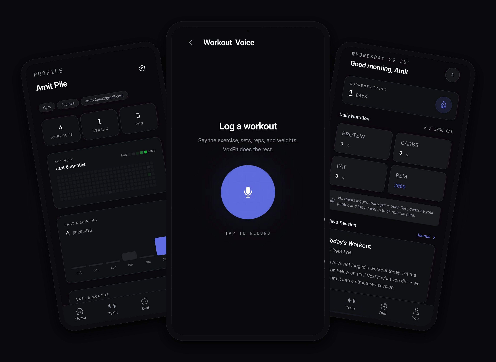
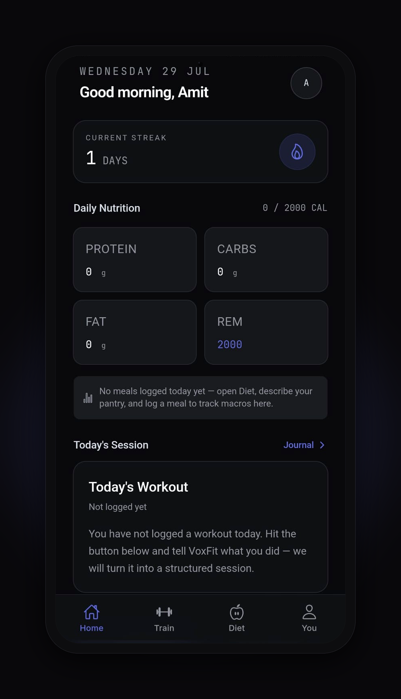
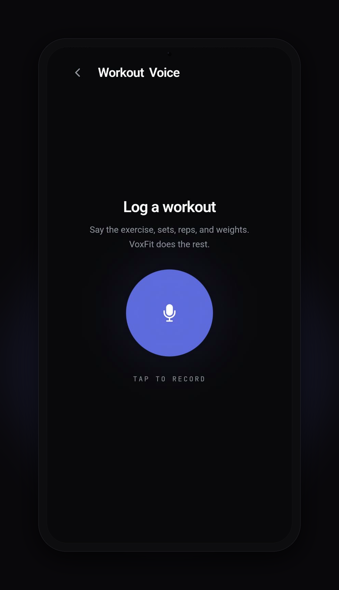
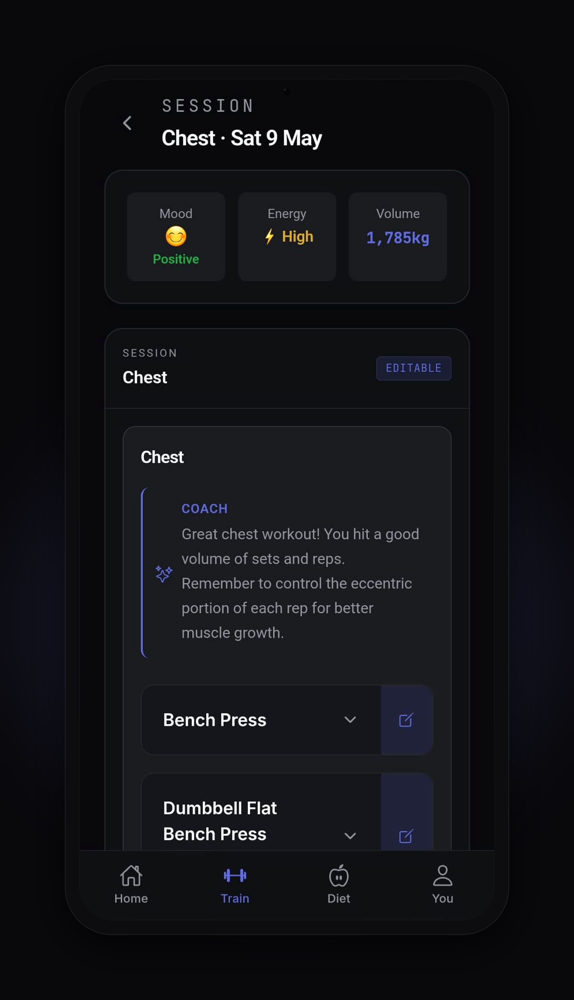
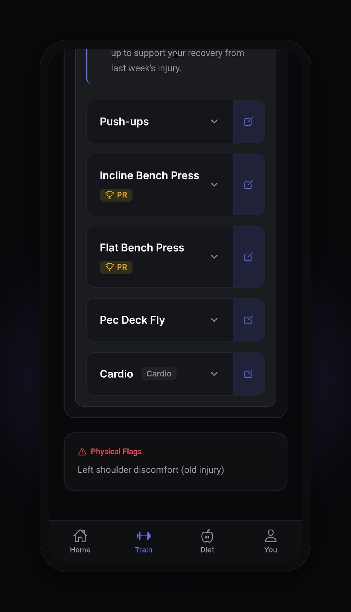
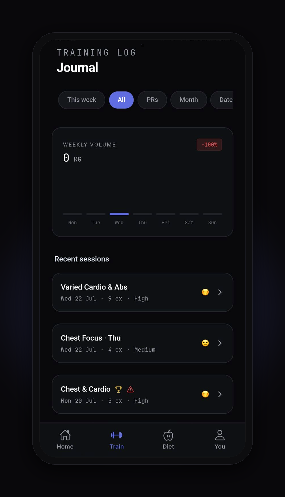
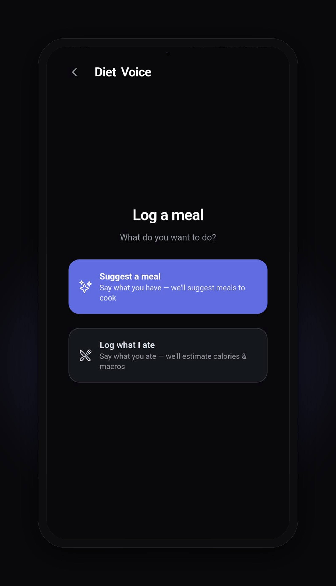
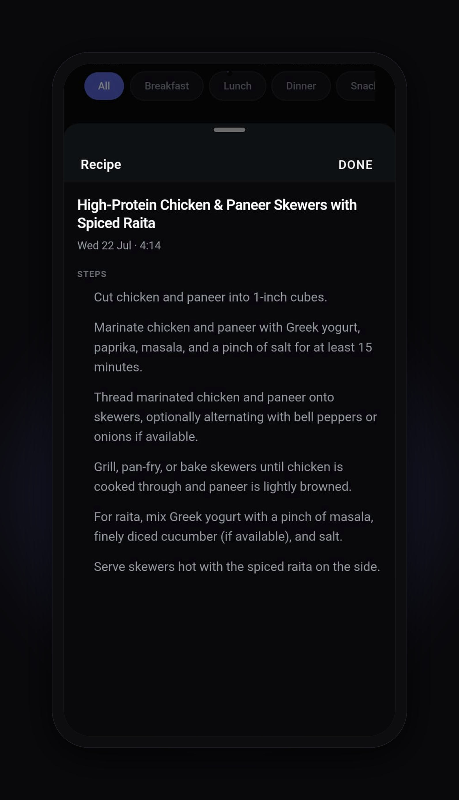
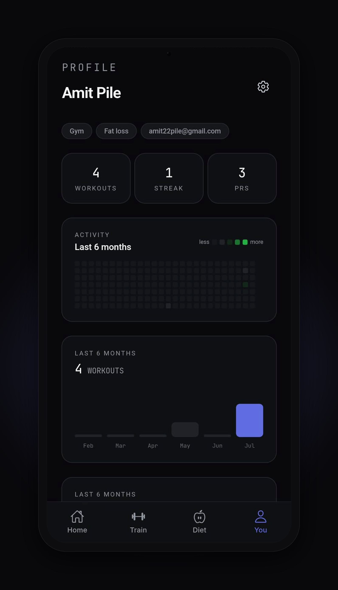

# VoxFit — Voice-First Fitness Logging for the Modern Gym

     [](https://voxfit.amitpile.com/auth/welcome)

**Speak your workout. Track your progress. Let an AI coach watch your trends.**

VoxFit is a voice-first fitness logging application designed for gym-goers and fitness communities who want to log their workouts and meals without typing. Just speak naturally — "did three sets of ten twenty thirty on bench" — and VoxFit's AI parses it into structured workout data in seconds. On top of that, an agentic AI coach generates personalized workout plans on demand, writes a weekly progress reflection automatically, and nudges you when your training has drifted from your plan.

🔗 **Live app:** [voxfit.amitpile.com](https://voxfit.amitpile.com/auth/welcome) · 📄 **PRD & Design:** [Notion doc](https://app.notion.com/p/VoxFit-PRD-and-Design-3a72d7e24b0581088740dd1e36936c8b#2b6e03e9372c443ea2d0cceba656e936)

## Project Glimpses



| | | |
|---|---|---|
|  Home — streak, daily macros, today's session |  Hold-to-talk workout capture |  Session detail — AI coach note per workout |
|  PR badges & recurring physical-note flags |  Training journal — weekly volume & history |  Diet voice — suggest a meal or log what you ate |
|  AI-suggested recipe from your pantry |  Profile — activity heatmap & stats | |

## Features

🎙️ **Voice-First Workout Logging**
- Hold-to-talk mic interface for capturing workout sessions
- AI-powered parsing (Gemini 2.5 Flash) converts natural speech into sets, reps, weights, cardio segments — even messy, repeated, or garbled mobile speech-to-text output
- Review & edit AI-extracted data before saving — your data, your control

🍽️ **Voice-Driven Meal Logging**
- Tap-to-speak meal suggestions based on your cravings and pantry, complete with recipes
- Tap-to-speak logging of meals you've already eaten — describe it once, AI estimates the nutrients and logs it
- Track calories and macros (Protein, Carbs, Fats) against daily targets
- Smart recommendations against your nutrition goals

🤖 **AI Workout Plan Generator** *(on-demand)*
- A real Gemini **tool-calling agent** — not a single prompt — reads your training history, recurring physical notes, and goals through read-only tools (`get_training_stats`, `get_recurring_notes`, …) before writing anything
- Generates a multi-day structured plan (`workout_plans` table) with a written rationale per session, grounded only in data the tools actually returned — no invented numbers
- Review the generated plan, then **Save** (marks it active, supersedes the previous plan) or discard
- Runs server-side in a Supabase Edge Function; the model never writes to the database directly — a deterministic orchestrator does, after parsing and validating the model's output

🧭 **AI Progress Coach** *(weekly reflection, on-demand + automatic)*
- The same agent engine, aimed at a different question: "how has this athlete actually been doing?"
- Reads training stats, nutrition adherence, and recurring physical notes over the trailing window, then writes a calm, plain-language reflection — highlights, trends, gentle recurring-note callouts, and suggestions for the week ahead
- **Safety-first prompt design**: purely observational, never diagnostic — no medical language, no "health flags," no assessment tone. A single non-alarmist "consider talking to a professional" line appears only for genuinely recurring notes, never repeated or dramatized
- Trigger it yourself from Profile ("Check my progress"), or let it run automatically every week — see **Weekly Automation** below

🔔 **Plan-vs-Actual Nudge** *(automatic, tied to your active plan)*
- If you have an active plan, the weekly coach run also compares planned sessions against what you actually logged and computes an adherence score and drift signal (on track / mild / severe)
- Plan age is accounted for, so a plan you started three days ago is never flagged as "severely behind" just because the full lookback window hasn't elapsed yet
- On severe drift, a calm nudge card on the Train tab offers to **refresh your plan** — one tap regenerates a plan that matches how you're actually training, instead of nagging you to catch up to a stale one

⏰ **Weekly Automation** *(`pg_cron` + `pg_net`, fully server-side)*
- Every Sunday at 06:00 UTC, a Postgres-scheduled job selects every user with logged activity in the last 30 days and dispatches one async, authenticated request per user to the coach's edge function — no idle users, no wasted AI calls
- Idempotent by design: each user gets **at most one** review and nudge per calendar week, safe to re-run or overlap without ever duplicating
- The exact same edge function serves both the manual "Check my progress" button and the weekly cron — one engine, two triggers, so what you test on-demand is exactly what runs unattended
- Passive **pointer cards** on Home ("New check-in ready," "New plan nudge") let you know something's waiting on Profile/Train without ever surfacing content on Home itself

📊 **Workout Analytics & History**
- Weekly workout volume tracking with bar charts
- Streak counter to stay motivated (days, weekly dots)
- Personal records (PR) badges and flagged exercises
- Mood/energy tracking per session for holistic logging
- Calendar heatmap of activity to visualize your consistency

⚙️ **Mobile-First, Offline-Ready**
- Responsive mobile-web app (desktop fallback supported)
- Progressive Web App (PWA) with offline caching
- One-codebase deployment to browsers and Play Store (via Capacitor)
- Integrates with native speech recognition (web & Android)

🎨 **Modern Dark UI**
- Linear-inspired design system (dark canvas, hairline borders, single lavender accent)
- Self-hosted fonts (Inter for text, JetBrains Mono for stats)
- Tailwind CSS v4 for rapid, consistent styling
- Fully accessible component library (vox-card, vox-badge, vox-icon) — the AI coach surfaces reuse the same calm, non-alarmist visual register even for "attention"-tone content (no red/danger styling, ever)

## Tech Stack

| Layer | Technology |
|-------|-----------|
| **Frontend** | Angular 20 (standalone components, signals), Ionic Angular 8, Tailwind CSS v4 |
| **Mobile/Desktop** | Capacitor 8 (native bridge to Android & web), Progressive Web App |
| **Backend** | Supabase (PostgreSQL, Auth, Edge Functions, `pg_cron`, `pg_net`, Vault) |
| **AI** | Google Gemini 2.5 Flash — both single-shot extraction (workout parsing, meal suggestions, eaten-meal analysis) and a **tool-calling agent loop** (workout plan generation, weekly progress coach) |
| **Automation** | `pg_cron` (weekly schedule) + `pg_net` (async HTTP dispatch) + Supabase Vault (secret storage) — server-side only, no third-party job queue |
| **Fonts** | Inter 500/600/700, JetBrains Mono 400/500 (self-hosted via @fontsource) |
| **Icons** | Ionicons 7 |
| **State** | Angular signals (lightweight, reactive) |

## Getting Started

### Prerequisites

- **Node.js** 18+ (npm 9+)
- **Supabase** account (free tier available)
- **Google Gemini API** key
- **Android SDK** (optional, for native development)

### Installation

```bash
# Clone the repo
git clone https://github.com/yourusername/voxfit.git
cd voxfit

# Install dependencies
npm install

# Set up environment
cp src/environments/environment.demo.ts src/environments/environment.dev.ts
# Edit environment.dev.ts with your Supabase URL, key, and Gemini API key
```

### Environment Setup

Edit `src/environments/environment.dev.ts`:

```typescript
export const environment = {
  supabaseUrl: 'https://YOUR_PROJECT.supabase.co',
  supabaseAnonKey: 'YOUR_ANON_KEY',
  geminiApiKey: 'YOUR_GEMINI_API_KEY',
  useGeminiEdgeFunction: true, // use Supabase Edge Function instead of client-side Gemini
};
```

### Development Server

```bash
# Start dev server (mobile viewport recommended)
npm start

# Build for production
npm run build:prod

# Test on Android (with Capacitor)
npm run android:run:dev
```

## Architecture

### Pages & Routes

- **Auth**: Welcome, Login, Register, Onboarding (profile setup)
- **Home**: Dashboard with streak, today's workout, nutrition macros, passive AI coach pointer cards
- **Voice Log** (`/voice`): Hold-to-talk workout capture with AI review
- **Workout** (`/tabs/workout`): Session history, list/detail views, weekly volume chart, active-plan card, plan-vs-actual nudge card
- **Workout Plan** (`/tabs/workout/plan`): Generate/review/save an AI-generated multi-day plan with per-session rationale
- **Diet Voice Log** (`/log-diet`): Tap-to-speak — suggest a meal from pantry/cravings, or log a meal you already ate
- **Diet** (`/tabs/diet`): Meal log and macro tracking
- **Profile** (`/tabs/profile`): Activity heatmap, goals, stats, AI progress-review card ("Check my progress")
- **Settings** (`/settings`): Edit profile & preferences (targets, sport, goal), about, sign out

### Data Flow — Voice Logging

```
User Voice Input
    ↓
Speech Recognition (Web/Android native)
    ↓
Transcript → Gemini AI (Edge Function)
    ↓
Structured Data (exercises, sets, reps, weight)
    ↓
User Review/Edit (vox-card, modals)
    ↓
Save to Supabase (PostgreSQL)
    ↓
Analytics & History (charts, heatmap, stats)
```

### Data Flow — AI Coach (agent + weekly automation)

```
                     ┌─────────────────────────┐
Tap "Check my        │                         │   pg_cron (Sun 06:00 UTC)
progress" / "Generate│                         │   selects active users (≥1 session
my plan" ────────────┤   Edge Function         │   or meal logged in last 30 days)
                     │   (Gemini tool-calling  │◄──┐
                     │    agent loop)          │   │ pg_net async HTTP POST
                     └───────────┬─────────────┘   │  (one call per user,
                                 │                  │   service-role authenticated)
                    read-only tools query           │
                    Postgres (training stats,       │
                    nutrition, recurring notes, ┌───┴────────────────┐
                    active plan, plan-vs-actual)│ pg_cron dispatcher │
                                 │               │ (security definer, │
                                 ▼               │  reads secrets from│
                   Deterministic orchestrator    │  Vault)            │
                   validates + writes JSON       └────────────────────┘
                   (model never writes to DB)
                                 │
                                 ▼
          workout_plans / progress_reviews / plan_nudges
          (idempotent: one row per user per week/plan)
                                 │
                                 ▼
        Plan review card · Progress review card · Plan-nudge card
        (Workout / Profile / Home pointer cards)
```

The **on-demand button** and the **weekly cron** hit the exact same edge function — the only difference is who's asking (a signed-in user's JWT vs. a server-side service-role call with a target `user_id`). That's a deliberate design choice: what you test manually is exactly what runs unattended.

## Design System

VoxFit uses a **Linear-inspired dark design system**, defined as CSS custom properties in `src/theme/variables.scss`:

| Token | Value | Use |
|-------|-------|-----|
| Canvas | `#0a0a0c` | App background |
| Surface-1 | `#101113` | Toolbar, tab bar |
| Surface-2 | `#16171a` | Resting cards |
| Surface-3 | `#1b1c1f` | Raised cards, modals |
| Surface-4 | `#212226` | Active/hover state |
| Primary Accent | `#5e6ad2` | CTA, focus ring, brand only |
| Success | `#27a644` | Positive indicators |
| Warning | `#d4a72c` | Caution, macro warnings |
| Danger | `#e5484d` | Destructive actions, errors |

**Typography** (Inter + JetBrains Mono)
- Display: 600 weight max, -0.02em tracking
- Body: 400 weight, -0.05px tracking
- Mono: Numeric displays (reps, weights, macros) for tabular alignment

**Spacing**: 4px base unit (4/8/12/16/24/32/48/96px tokens)
**Radii**: xs(4px) → sm(6px) → md(8px) → lg(12px) → xl(16px) → pill(9999px)

**Rules**
- Single scarce accent — never as card fill or gradient
- No pill-shaped CTAs (md radius only)
- No box-shadows — hierarchy via surface ladder + hairlines
- Emoji chrome → ionicons; AI-generated data emoji stays

**Page shell convention**
- `vox-page-header` / `vox-card` are reserved for the auth flow (welcome, login, register, onboarding)
- Every other screen (tabs + standalone routes like `/voice`, `/log-diet`, `/settings`) uses a plain `<header>` with `vox-standalone-page` / `tab-page-content` classes and Tailwind utilities directly

## Project Structure

```
voxfit/
├── src/
│   ├── app/
│   │   ├── pages/          # Route components (home, voice-log, diet, diet-voice-log, workout,
│   │   │                   #   workout-detail, workout-plan, auth, profile, settings)
│   │   ├── components/     # Shared UI (vox-card, vox-badge, vox-icon, vox-page-header) + feature
│   │   │                   #   components: exercise editor/review, password checklist,
│   │   │                   #   plan-review-card, progress-review-card, plan-nudge-card,
│   │   │                   #   coach-pointer-card (passive Home pointers)
│   │   ├── services/       # Auth, voice, Gemini (workout extract + diet + workout-plan + checkin),
│   │   │                   #   Supabase, journal, diet log, nutrition dashboard, workout-plan,
│   │   │                   #   progress-coach (review/nudge signals + acknowledge)
│   │   ├── models/         # TypeScript types, one file per exported interface/type, all re-exported
│   │   │                   #   from models/index.ts — every consumer imports from `@/app/models`
│   │   ├── guards/         # Route guards (auth, onboarding)
│   │   ├── utils/          # Formatters, mappers (workout display, exercise parsing/drafts)
│   │   ├── prompts/        # Gemini system prompts (workout parser, meal suggester, eaten-meal
│   │   │                   #   logger, workout-plan builder, weekly coach builder)
│   │   └── data/           # Small fallback/mock display constants (not types)
│   ├── theme/              # Design tokens (variables.scss) + shared styles (buttons, headers, fonts)
│   ├── global.scss         # Tailwind config, Ionic imports, fonts
│   └── index.html          # PWA manifest, viewport, meta tags
├── android/                # Capacitor Android project
├── supabase/
│   ├── functions/          # extract-workout, suggest-diet-meals, log-food (single-shot Gemini calls)
│   │                       # generate-workout-plan, generate-checkin (Gemini tool-calling agent)
│   └── migrations/         # 0001 workout_plans · 0002 progress_reviews + plan_nudges
│                           # 0003 pg_cron/pg_net weekly dispatcher · 0004 service_role grants
├── capacitor.config.ts     # Capacitor config (appId: com.voxfit.app)
└── angular.json            # Angular CLI workspace config
```

All type declarations live under `src/app/models/`, one file per exported interface/type (e.g. `user-profile.model.ts`, `workout-session-row.model.ts`), and re-exported through a single `models/index.ts` barrel — every consumer imports from `@/app/models` rather than reaching into individual files.

## Deployment

### Web (PWA)
```bash
npm run build:prod
# Deploy www/ directory to Vercel, Netlify, or any static host
```

`environment.prod.ts` is git-ignored (see [Environment setup](#environment-setup) below), so hosts that
build from a fresh clone — like Cloudflare Pages — won't have it. `npm run build:prod` runs
`scripts/generate-prod-env.js` first, which generates it from env vars if the file isn't already
present. Set these in the host's project settings:

- `supabaseUrl`
- `supabaseAnonKey`
- `geminiApiKey` (optional — unused when `useGeminiEdgeFunction` is true)
- `useGeminiEdgeFunction` (optional — anything other than the string `"false"` is treated as true)

Build command: `npm run build:prod`. Output directory: `www`.

### Android (Play Store)

One-time setup: copy `android/key.properties.example` to `android/key.properties` (git-ignored)
and fill in the path to your release keystore plus its passwords. Keep the `.jks` file itself
outside this repo entirely, and back it up somewhere durable — if you lose it, Play Store has
no recovery path and you'd have to publish as a brand-new app.

```bash
npm run android:prepare:prod

# Either build from the command line once key.properties is set up:
cd android && ./gradlew bundleRelease
# → android/app/build/outputs/bundle/release/app-release.aab

# ...or from Android Studio: Build → Generate Signed Bundle/APK
# Then follow the Play Store submission flow.
```

## Development Workflow

1. **Local dev**: `npm start` → browser mobile viewport (Chrome DevTools)
2. **Component changes**: Edit `.ts`/`.html`/`.scss`, save → auto-reload
3. **Design token changes**: Edit `src/theme/variables.scss` → impacts all screens
4. **Voice testing**: Use web Speech API in Chrome, or native Android emulator/device
5. **Build verification**: `npm run build:dev` (2 min)
6. **Android smoke test** (before landing): `npm run android:run:dev`

## API & Services

### Supabase Tables

- `user_profiles` — User info, goals, macro targets, onboarding status
- `workout_sessions` — Logged workouts (date, mood, energy, raw/cleaned transcript, coach summary)
- `exercises_logged` — Exercise rows per session (name, type, PR flag, `set_lines` JSONB for per-set reps/weight/duration/distance)
- `diet_logs` — Meal entries (date, meal type, macros, source: AI-suggested or manually logged)
- `workout_plans` — AI-generated plan content (JSONB) + status (`active`/superseded), one active plan per user at a time
- `progress_reviews` — Weekly AI coach reflections (highlights, trends, recurring notes, suggestions), unique per `(user_id, generated_for_week)`
- `plan_nudges` — Weekly plan-vs-actual adherence + drift signal, tied to the active plan, unique per `(user_id, generated_for_week)`

All tables have Row Level Security enabled, scoped to `auth.uid()` (directly on `user_id`/`id` for most, via a `workout_sessions` ownership join for `exercises_logged`). The two AI-coach tables' unique `(user_id, generated_for_week)` indexes are what make the weekly automation idempotent — re-running or overlapping never produces a duplicate.

### Gemini Edge Functions

**Single-shot extraction:**
- **`extract-workout`** — Deno runtime, POST transcript → structured `WorkoutExtractResult`
- **`suggest-diet-meals`** — Deno runtime, POST pantry/cravings → meal suggestions with macros & recipe
- **`log-food`** — Deno runtime, POST a description of a meal already eaten → single nutrient-estimated meal entry

**Agentic (tool-calling loop, read-only tools, deterministic writes):**
- **`generate-workout-plan`** — builds a multi-day plan grounded in the athlete's own training data; on-demand only
- **`generate-checkin`** — writes the weekly progress review and, when an active plan exists, the plan-vs-actual nudge. Reached two ways: a signed-in user's JWT (manual "Check my progress"), or a service-role call carrying a target `user_id` (the weekly `pg_cron` dispatcher) — same function, same code path, different caller

### Weekly Automation Internals

- `coach_active_user_ids(window_days)` — `security definer` SQL function selecting every user with ≥1 workout session or diet log in the trailing window (default 30 days)
- `run_weekly_checkins()` — `security definer` dispatcher: reads the function URL and service-role key from **Supabase Vault** (never hardcoded, never committed), then fires one `pg_net.http_post` per active user
- `cron.schedule('weekly-checkin', '0 6 * * 0', …)` — every Sunday at 06:00 UTC
- Both privileged functions have `execute` revoked from `anon`/`authenticated` — only the scheduler can invoke them

## Contributing

Contributions welcome! Follow these guidelines:

1. **Branches**: Feature branches off `main` (e.g., `feat/voice-improvements`)
2. **Commits**: Conventional commits (`feat:`, `fix:`, `refactor:`, `docs:`)
3. **PRs**: Describe the "why" — what user problem does this solve?
4. **Tests**: Add unit tests for new services (auth, gemini, journal)
5. **Mobile testing**: Verify on real/emulated Android before landing

## Future Features

**AI Coach — next up:**
- Push notifications (FCM) for the weekly check-in and plan nudge, supplementing today's passive in-app pointer cards — schema is already designed to accommodate this without rework
- Per-user schedule control (custom day/time instead of one global Sunday run for everyone)
- Real server-side streak calculation for the coach's training snapshot (currently stubbed at 0 server-side; the client-facing streak is unaffected)
- Retry/backoff for a failed weekly dispatch, rather than waiting for next week's run

**Platform:**
- Offline-first workout logging (service worker + IndexedDB sync)
- Social features (share sessions, friend leaderboards)
- Wearable integration (Apple Watch, Wear OS)

> iOS is not on the near-term roadmap — the Capacitor bridge is technically portable, but there's no active plan to build or test an iOS release right now.

## License

MIT — see LICENSE file

## Support & Feedback

Found a bug? Have a feature idea? [Open an issue](https://github.com/yourusername/voxfit/issues) or reach out via [email/Discord/etc.].

---

**Built for the modern gym-goer who speaks faster than they type.** 🎙️💪
